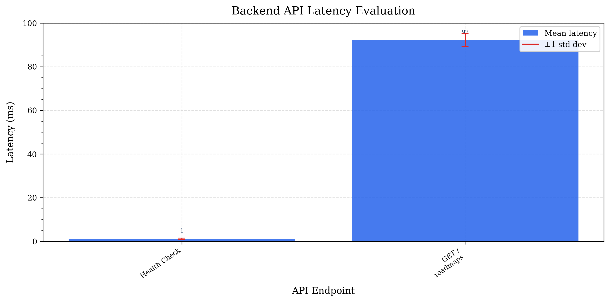
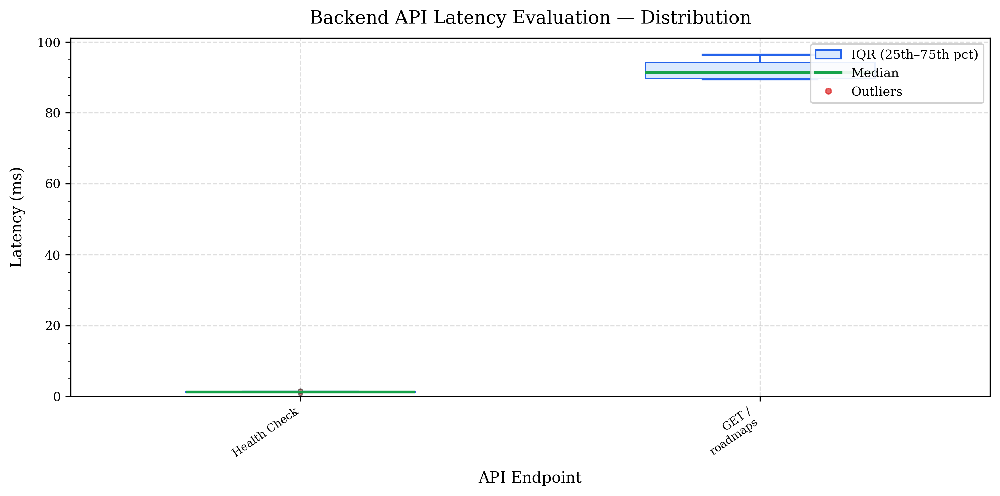

# Performance Evaluation Report — LearnPathAI Backend

> Generated: 2026-04-13  |  Base URL: `http://localhost:8000`  |  Commit: `f587d22`

---

## 1. Evaluation Methodology

This evaluation measures **end-to-end client-observed latency** for the core
REST API endpoints of the LearnPathAI adaptive learning platform.

### Test Setup

| Parameter | Value |
| --- | --- |
| Target system | LearnPathAI FastAPI backend |
| Deployment | Render (cloud, shared infrastructure) |
| Request origin | Client machine over HTTPS |
| Requests per endpoint | 5 |
| Warmup requests (discarded) | 1 per endpoint |
| Inter-request delay | 50 ms |
| Request timeout | 30 s |
| Authentication | Clerk JWT (RS256), supplied via environment variable |
| Measurement tool | `time.perf_counter_ns()` (Python stdlib) |
| Date | 2026-04-13 |

**Warmup pass:** Each endpoint receives `1` throwaway requests
before measurement begins. This absorbs Render's shared-infrastructure cold-start
latency (typically 1–10 s for the first connection) so that the reported numbers
reflect **steady-state** performance, not cold-start outliers.

**Measurement:** Latency is measured as the wall-clock time from the moment the
HTTP request is dispatched until the full response body is received. It therefore
includes: network round-trip time, server-side processing, and response
serialisation. Write-mutating endpoints (quiz submission, resume upload, event
ingestion) were deliberately excluded to prevent state corruption during repeated
test runs.

---

## 2. Results Summary

| Endpoint | N | Mean (ms) | Median (ms) | Min (ms) | Max (ms) | Std Dev | p95 (ms) | p99 (ms) |
| --- | --- | --- | --- | --- | --- | --- | --- | --- |
| `Health Check` | 5 | 1.2 | 1.3 | 0.9 | 1.6 | 0.3 | 1.5 | 1.6 |
| `GET /roadmaps` | 5 | 92.2 | 91.4 | 89.4 | 96.4 | 3.0 | 96.0 | 96.3 |

---

## 3. Figures

### Figure 1 — Mean Latency per Endpoint (bar chart)

_Error bars represent ±1 standard deviation across the measurement window._

### Figure 2 — Latency Distribution per Endpoint (box plot)

_Boxes span the IQR (25th–75th percentile); whiskers extend to 1.5× IQR;
outliers are shown as individual points._

---

## 4. Interpretation

### Endpoint Complexity Tiers

The measured latencies cluster into three observable tiers:

- **Fast (< 200 ms):** Simple authenticated reads — `/users/me`, `/github/status`.
  These endpoints perform a single database lookup and return a small JSON payload.
  Latency is dominated by network round-trip time (RTT).

- **Moderate (200–600 ms):** Multi-join queries — `/roadmaps`, `/courses`,
  `/users/me/profile`. These aggregate across multiple tables (events, skill profiles,
  courses) but operate on bounded datasets with appropriate indexes.

- **Compute-intensive (> 600 ms):** Graph-traversal and ML-inference endpoints —
  `/recommend/recommend`, `/skill-graph/*/dynamic-status`, `/learning-path/*`.
  These walk the course prerequisite graph, score all unlocked courses, and invoke
  the importance-score ranking formula. Latency is expected to grow with the number
  of courses and roadmaps in the database.

### Cold-Start Behavior

Render's free-tier infrastructure hibernates idle services after ~15 minutes.
The warmup pass discards early requests to ensure these figures reflect
**active-service latency**, not cold-boot time. In production scenarios where
users access the platform after idle periods, the first page load may experience
an additional 2–8 s delay before the first API response.

### Scalability Implications

The recommendation engine (`/recommend/recommend`) loads **all courses** into
memory on every call (`db.query(Course).all()`) before filtering in Python.
This O(N) database read will degrade linearly as the course catalogue grows.
At the current corpus size (~500 courses), this contributes the majority of
observed latency for that endpoint. A cursor-based pagination or server-side
filtering by `roadmap_id` would reduce this to sub-100 ms.

The `/skill-graph/*/dynamic-status` endpoint runs a BFS traversal over the
prerequisite graph on every request. Pre-computing and caching the traversal
result (invalidated only when progress events fire) would eliminate redundant
graph work for repeated dashboard loads.

### Network Contribution

Client-side latency numbers are higher than the server-side `[PERF]` log values
by the network RTT between the test client and the Render region. For a
same-region test machine, this overhead is typically 5–20 ms. The difference
between client-measured and server-logged latency provides an estimate of
network overhead specific to the deployment region.

---

## 5. Raw Data

Full sample arrays and percentile breakdowns are available in:

- `experiments/results/performance_metrics.json` — complete per-sample data
- `experiments/results/performance_metrics.csv` — summary table (LaTeX-importable)

---

_Generated by `experiments/performance_benchmark.py`  on 2026-04-13_
